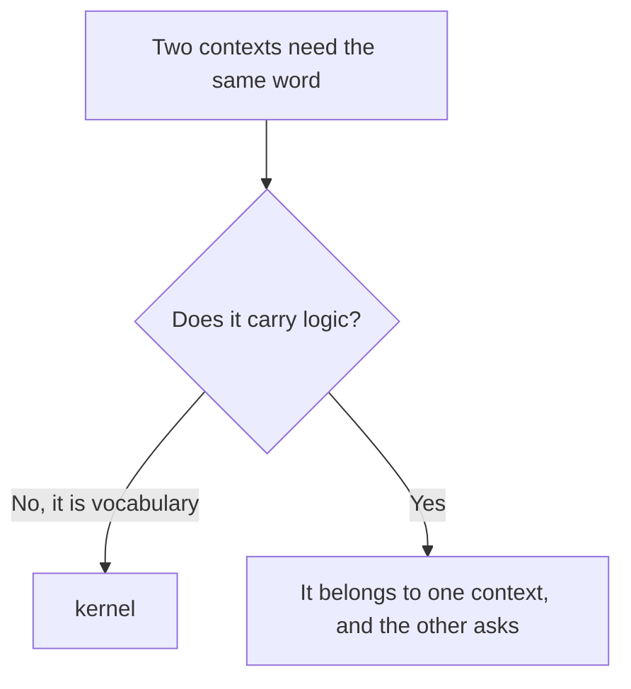
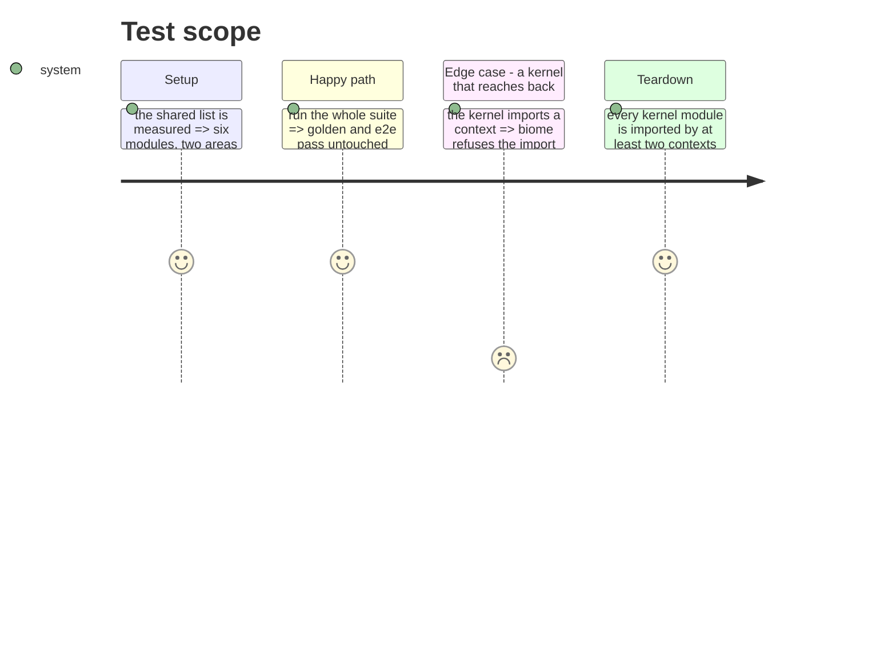

# Instruction: Extract the kernel

Six modules pass the two-area rule and are the shared vocabulary of every context: tool identity,
where content comes from, project paths, files and their hashes, merge strategies, and errors.

They get a home and a name, and their names move up from mechanism to concept — the project's own
naming rule.

## Architecture projection

> Tree of the final files. ✅ create · ✏️ modify · ❌ delete

```txt
.
└── cli/src/kernel/                  ✅ create
    ├── tool.ts                      ✏️ modify (from domain/models/tool-ids.ts)
    ├── source.ts                    ✏️ modify (from domain/models/plugin-source.ts)
    ├── paths.ts                     ✏️ modify (from domain/models/paths.ts)
    ├── file.ts                      ✏️ modify (from domain/models/file.ts)
    ├── merge.ts                     ✏️ modify (from domain/models/merge.ts)
    ├── errors.ts                    ✏️ modify (from domain/errors.ts)
    └── ports/                       ✅ create (file-reader, file-writer, hasher, logger, asset-provider)
```

## User Journey



## Test Scope



## Tasks to do

### `1)` Move the six, renamed to the concept

1. `tool-ids.ts` becomes `tool.ts`, `plugin-source.ts` becomes `source.ts`. The others keep their
   names, which already say the concept.
2. No directory per module: six files, six directories would be structure for its own sake.

### `2)` Move the shared ports

1. `file-reader`, `file-writer`, `hasher`, `logger` and `asset-provider` serve at least two
   contexts. The rest stay with the context that owns them.

### `3)` Forbid the reverse edge

1. Add a biome `override`: the kernel may not import from any context. Verify it refuses a
   deliberate violation.

### `4)` Poser les deux filets dont les extractions suivantes dépendent

> La phase 10 ne peut pas fermer un contexte sans une frontière à opposer, et aucune extraction ne
> peut se dire réussie sans une mesure du découpage. Les deux viennent ici, avant la première.

1. **Cliquet de frontière.** Une importation venue d'un autre contexte ne vise qu'un module que le
   contexte cible déclare public ; tout le reste est intérieur. La liste des modules publics est la
   donnée du test, elle ne peut que rétrécir. C'est ce qui remplace l'`index.ts` retiré de l'arbre
   cible — voir `arborescence.md`, invariant 4.
2. **Remettre Stryker en marche.** Il ne tourne pas depuis une montée de TypeScript, et aucun job ni
   hook ne l'appelle, ce qui est la raison pour laquelle personne ne l'a vu casser. La phase 14 a
   besoin d'une mesure **avant** de redécouper le Manifest, et une mesure prise après ne prouve rien
   sur le redécoupage : la réparation doit donc précéder, pas suivre. La campagne large reste la
   phase 20.
3. **Cliquet de taille de dossier.** Un dossier ne porte pas plus de dix fichiers source directs,
   règle reprise du harnais de `gouvernail`. Les six dossiers qui dépassaient avant la phase 7 —
   à remesurer au moment de poser le cliquet, la phase 7 ayant vidé `shared/` entre-temps :
   `domain/models` 29, `domain/ports` 25, `infrastructure/adapters` 23, `domain/formats` 21,
   `application/commands` 16, `use-cases/shared` 14. La base de départ est cette liste, et chaque
   extraction doit la faire rétrécir — c'est la mesure du découpage, pas une opinion sur lui.

## Test acceptance criteria

| Task | Acceptance criteria |
| ---- | ------------------- |
| 1    | Every consumer imports the kernel; no duplicate of a moved module remains |
| 2    | A port in the kernel is used by two contexts or more; a port used by one moved with it |
| 4    | Both ratchets fail on a deliberate violation, and their baselines shrink at every later extraction |
| 3    | An import from the kernel to a context fails the lint, verified by introducing one |
| all  | Golden and e2e pass **unmodified** |
