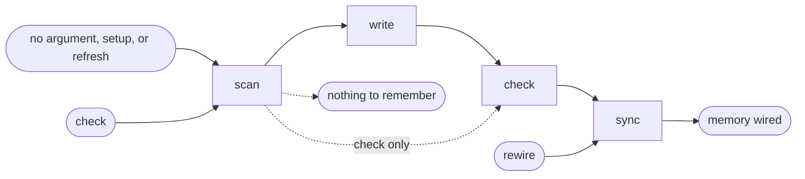

# Project Memory

## Actions

Run the flow above, reading only the next action file.

| Action | Does                            |
| ------ | ------------------------------- |
| scan   | read the project                |
| write  | write the memory                |
| check  | judge it, report what drifted   |
| sync   | pick the tools, wire it in      |

## Transversal rules

- If a referenced file cannot be read, stop and say so. Never invent its content.
- Ask before anything ambiguous. Never default silently.
- Create or revise a file, keeping every line the user wrote. Drop such a line, or a whole file, only when the user asks.
- End with a short report of what changed.
