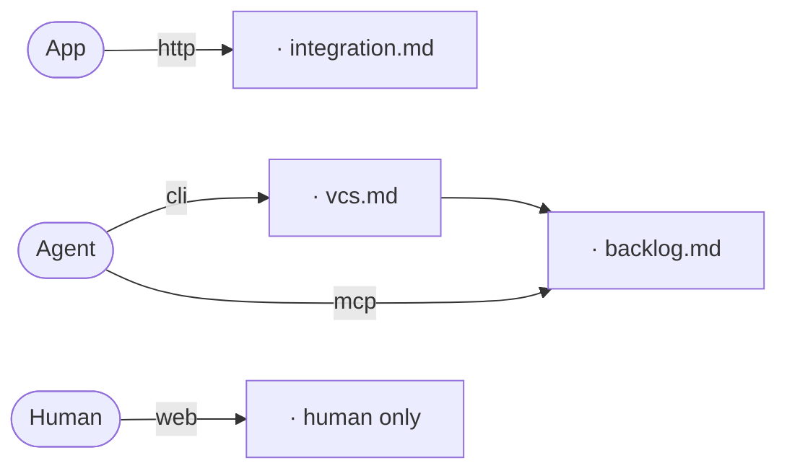

# Ecosystem

<!--
Capture: every external tool, how each actor reaches it, and what moves between tools.
Skip: a build step, a live value, and any detail the named file already owns.
Rebuild the graph from the scan, never keep this one.
An actor edge carries the access mode, a hand-off edge carries what moves between two distinct
tools, and a tool a memory file owns names that file after a middle dot.
The file is the heading and the graph. Nothing follows it, not a note, not a caption.
Remove this comment when filled.
-->
