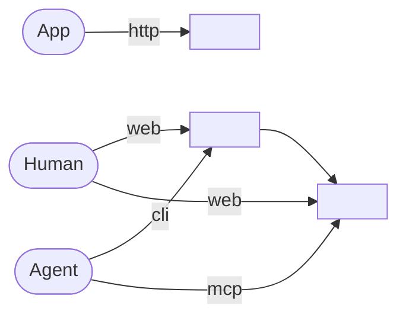

# Ecosystem

<!--
Capture: every external tool, how each actor reaches it, and what moves between tools.
Skip: a build step, a live value, and any detail a clicked file already owns.
Rebuild the graph from the scan, never keep this one.
The file is the heading and the graph. Nothing follows it, not a note, not a caption.
Remove this comment when filled.
-->
