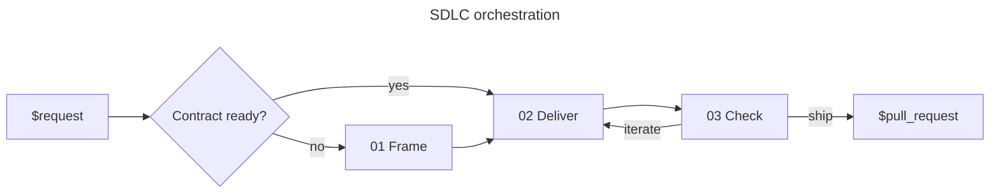

# Skill: sdlc

## References

Read only the current zone's reference before delegating it.

| #   | Reference                                      | Does                                  |
| --- | ---------------------------------------------- | ------------------------------------- |
| 01  | [Frame](references/01-frame.md)                | Resolve a planning-ready contract     |
| 02  | [Deliver](references/02-deliver.md)            | Build and validate a committed change |
| 03  | [Check](references/03-check.md)                | Review independently and open the PR  |

## Transversal rules

- Own routing and verify every handoff against the current reference.
- Treat the canonical plugin addresses in the references as the responsibility map. Verify that each named provider is installed before calling it.
- Run planning in the orchestrator context. Isolate implementation in `executor` and independent review in `checker`.
- Mode: default `interactive`, pausing for approval at each step; switch to `auto` only when the caller says so, then decide alone and never ask.
- Stop on `blocked`. Loop `check → deliver` on `iterate`.
