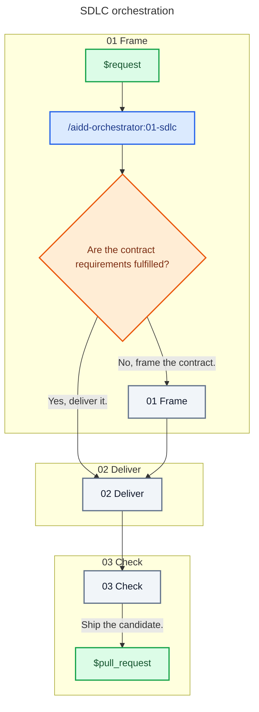

# Skill: sdlc

## Behavior

Own every routing decision. Verify each handoff against the current reference. Treat canonical addresses as the responsibility map and verify that each provider is installed before calling it. Work autonomously, making reversible in-scope decisions without asking and requesting input only when product authority or external approval is missing. Decide from contract and acceptance criteria, project rules, correctness and security, simplicity, then speed.

Keep planning in the orchestrator, implementation in `@aidd-dev:executor`, and independent judgment in fresh `@aidd-dev:checker` instances. Continue until the branch is clean, every applicable validation is green, the current SHA has passed review and challenge, and a draft pull request exists. Exhaust safe alternatives before returning `blocked`. Route contract gaps to Frame and implementation gaps to Deliver.

## References

Read only the current zone's reference before delegating it.

| #   | Reference                                      | Does                                  |
| --- | ---------------------------------------------- | ------------------------------------- |
| 01  | [Frame](references/01-frame.md)                | Resolve a planning-ready contract     |
| 02  | [Deliver](references/02-deliver.md)            | Build and validate a committed change |
| 03  | [Check](references/03-check.md)                | Review independently and open the PR  |
