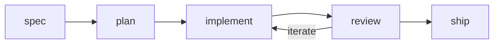

# Skill: sdlc

## Actions

Read only the next action's file before running it.

| #   | Action      | Does                                         |
| --- | ----------- | -------------------------------------------- |
| 01  | `spec`      | Consolidate sources into the contract        |
| 02  | `plan`      | Produce the plan file                         |
| 03  | `implement` | Build the plan's code and gate on assertions |
| 04  | `review`    | Return a `ship` or `iterate` verdict         |
| 05  | `ship`      | Open the change request                       |

## Transversal rules

- Delegate implementation and review; never write or judge code yourself.
- Mode: default `interactive`, pausing for approval at each step; switch to `auto` only when the caller says so, then decide alone and never ask.
- Every step runs; only `01-spec` self-skips when the source already states an objective and acceptance criteria.
- Drive the plan status `pending → in-progress → implemented → reviewed`, or `blocked`.
- Every artifact (spec, plan, phases, review) lands in one feature folder, `aidd_docs/tasks/<yyyy_mm>/<yyyy_mm_dd>_<slug>/`, resolved at entry.
