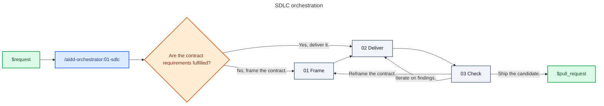

# Skill: sdlc

## References

Read only the current zone's reference before delegating it.

| #   | Reference                                      | Does                                  |
| --- | ---------------------------------------------- | ------------------------------------- |
| 01  | [Frame](references/01-frame.md)                | Resolve a planning-ready contract     |
| 02  | [Deliver](references/02-deliver.md)            | Build and validate a committed change |
| 03  | [Check](references/03-check.md)                | Review independently and open the PR  |

## Transversal rules

- Own routing and verify every handoff against the current reference.
- Treat the canonical plugin addresses in the references as the responsibility map. Verify that each named provider is installed before calling it.
- Work autonomously by default. Make every reversible in-scope decision without asking; ask only when product authority is missing or an external action requires approval.
- Decide in this order: contract and acceptance criteria, project rules, correctness and security, simplicity, then speed.
- Run planning in the orchestrator context. Isolate implementation in `executor` and independent review in `checker`.
- Continue until the branch is clean, every applicable validation is green, the current SHA has passed independent review and the confidence challenge, and a draft pull request exists.
- Stop on `blocked` only after exhausting safe in-scope alternatives. Route contract gaps to `frame` and implementation gaps to `deliver`.
