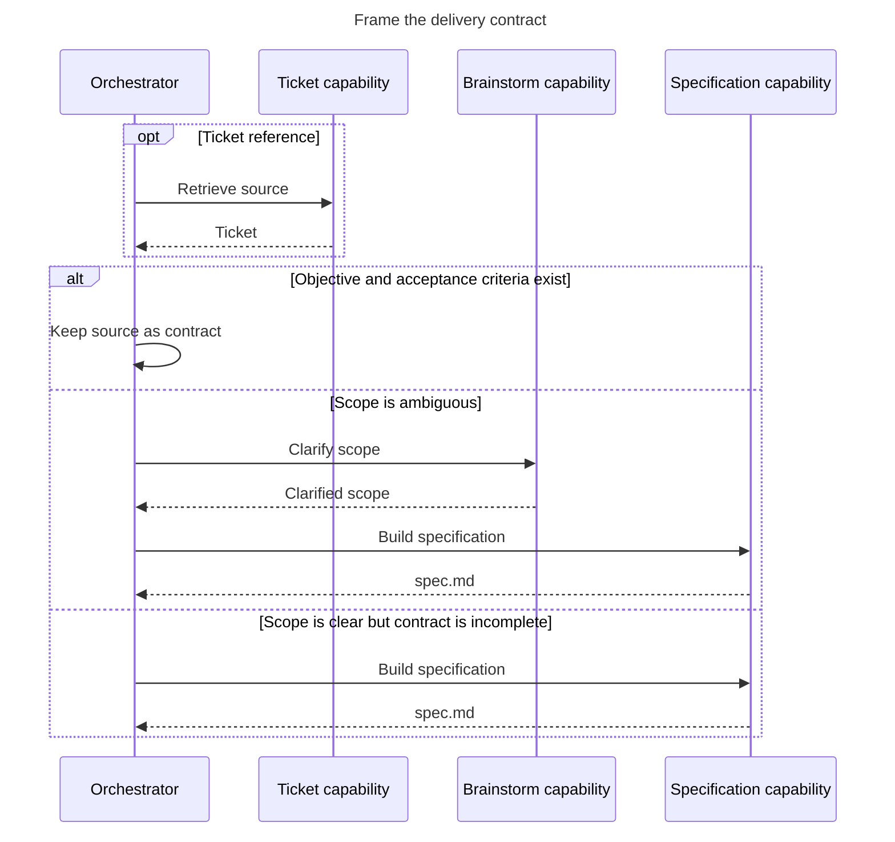

# 01 - Frame

Decide whether the source is ready for planning.

- The orchestrator owns the readiness decision.
- A ready contract has an explicit objective and observable acceptance criteria.
- Return the source contract or `spec.md` to `02-deliver`.
