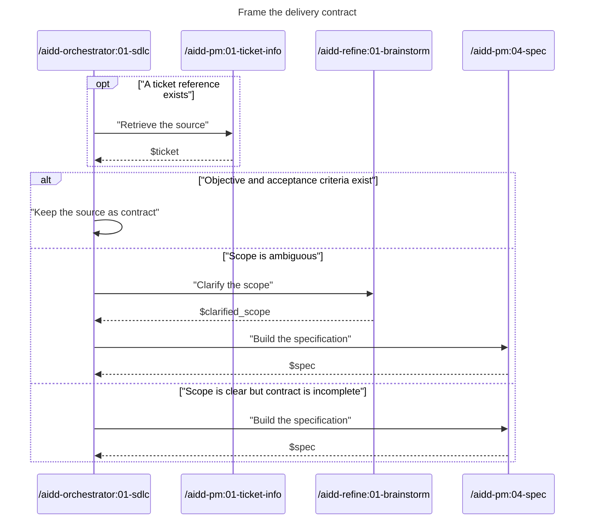

# 01 - Frame

Decide whether the source is ready for planning.

- `/aidd-orchestrator:01-sdlc` owns the readiness decision.
- A ready contract has an explicit objective and observable acceptance criteria.
- Return `$contract` or `$spec` to `02-deliver`.
