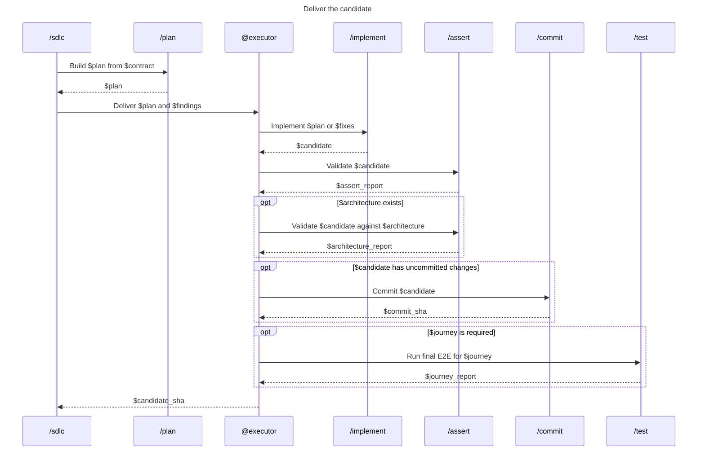

# 02 - Deliver

Produce a validated candidate from the contract.

- `/sdlc` owns `$plan`; `@executor` never rewrites it.
- `@executor` implements and self-validates. It does not perform the independent review.
- `@executor` runs the architecture facet of `/assert` when architecture documentation applies.
- Run E2E only after implementation, assertions, and commits are complete. A failure re-enters delivery before one final E2E run.
- Return only a clean candidate with green validation to `03-check`.
