# 02 - Deliver

## Behavior

Create a self-contained plan that a human can follow. Keep it proportional to the scope. The executor implements the plan without rewriting it. Use focused checks while repairing the candidate, then run every applicable assertion before completion. Check architecture only when architecture documentation exists.

Commit the validated candidate. Run the required E2E journey last. Send only a clean candidate with green validation to Check.

```mermaid
---
title: Deliver the candidate
---
flowchart TD
  subgraph Build["Build the candidate"]
    direction TB
    Contract["$contract"]
    Sdlc["/aidd-orchestrator:01-sdlc"]
    Plan["/aidd-dev:01-plan"]
    PlanArtifact["$plan"]
    Executor(["@aidd-dev:executor"])
    Implement["/aidd-dev:02-implement"]
    Candidate["$candidate"]
  end

  subgraph Validate["Validate the candidate"]
    direction TB
    AssertCode["/aidd-dev:03-assert"]
    AssertionsPassed{"Did all assertions pass?"}
    ArchitectureDecision{"Is architecture documentation available?"}
    AssertArchitecture["/aidd-dev:03-assert"]
    ArchitecturePassed{"Does the candidate conform to the documented architecture?"}
  end

  subgraph Finalize["Finalize the candidate"]
    direction TB
    CommitDecision{"Are there uncommitted changes?"}
    Commit["/aidd-vcs:01-commit"]
    JourneyDecision{"Is an end-to-end user journey required?"}
    Test["/aidd-dev:06-test"]
    JourneyPassed{"Did the end-to-end user journey pass?"}
    CommittedCandidate["$committed_candidate"]
  end

  Repair["02 Deliver"]
  Check["03 Check"]

  Contract --> Sdlc
  Sdlc --> Plan
  Plan --> PlanArtifact
  PlanArtifact --> Executor
  Executor --> Implement
  Implement --> Candidate
  Candidate -- "Run the assertions." --> AssertCode
  AssertCode --> AssertionsPassed
  AssertionsPassed -- "No, repair and validate the candidate again." --> Repair
  AssertionsPassed -- "Yes, continue." --> ArchitectureDecision
  ArchitectureDecision -- "Yes, run assert-architecture." --> AssertArchitecture
  AssertArchitecture --> ArchitecturePassed
  ArchitecturePassed -- "No, repair and validate the candidate again." --> Repair
  ArchitecturePassed -- "Yes, continue." --> CommitDecision
  ArchitectureDecision -- "No, continue." --> CommitDecision
  CommitDecision -- "Yes, commit the candidate." --> Commit
  Commit --> JourneyDecision
  CommitDecision -- "No, continue." --> JourneyDecision
  JourneyDecision -- "Yes, run test-journey." --> Test
  Test --> JourneyPassed
  JourneyPassed -- "No, repair and validate the candidate again." --> Repair
  JourneyPassed -- "Yes, continue." --> CommittedCandidate
  JourneyDecision -- "No, continue." --> CommittedCandidate
  CommittedCandidate --> Check

  classDef skill fill:#DBEAFE,stroke:#2563EB,color:#1E3A8A,stroke-width:2px
  classDef agent fill:#F3E8FF,stroke:#9333EA,color:#581C87,stroke-width:2px
  classDef artifact fill:#DCFCE7,stroke:#16A34A,color:#14532D,stroke-width:2px
  classDef decision fill:#FFEDD5,stroke:#EA580C,color:#7C2D12,stroke-width:2px
  classDef zone fill:#F1F5F9,stroke:#64748B,color:#0F172A,stroke-width:2px

  class Sdlc,Plan,Implement,AssertCode,AssertArchitecture,Commit,Test skill
  class Executor agent
  class Contract,PlanArtifact,Candidate,CommittedCandidate artifact
  class AssertionsPassed,ArchitectureDecision,ArchitecturePassed,CommitDecision,JourneyDecision,JourneyPassed decision
  class Repair,Check zone
```

