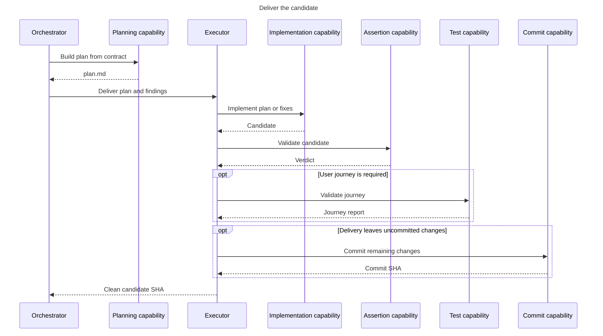

# 02 - Deliver

Produce a validated candidate from the contract.

- The orchestrator owns `plan.md`; the executor never rewrites it.
- The executor implements and self-validates. It does not perform the independent review.
- Return only a clean candidate with green validation to `03-check`.
