# 02 - Deliver

## Behavior

Own the plan in `/aidd-orchestrator:01-sdlc` and delegate implementation to `@aidd-dev:executor`. The executor never rewrites the plan. Require the executor to implement and self-validate without performing the independent review. Run coding assertions, then architecture assertions through `/aidd-dev:03-assert` when architecture documentation applies. A failed assertion, architecture check, or E2E journey re-enters Deliver and reruns every applicable gate.

Commit the validated candidate through `/aidd-vcs:01-commit`. Run the required E2E journey through `/aidd-dev:06-test` as the final delivery gate. Send only a clean candidate with green validation to Check.

```mermaid
---
title: Deliver the candidate
---
flowchart LR
  subgraph Build["Build the candidate"]
    direction TB
    Contract["$contract"]
    Sdlc["/aidd-orchestrator:01-sdlc"]
    Plan["/aidd-dev:01-plan"]
    PlanArtifact["$plan"]
    Executor(["@aidd-dev:executor"])
    Implement["/aidd-dev:02-implement"]
    Candidate["$candidate"]
  end

  subgraph Validate["Validate the candidate"]
    direction TB
    AssertCode["/aidd-dev:03-assert"]
    AssertionsPassed{"Did all assertions pass?"}
    ArchitectureDecision{"Is architecture documentation available?"}
    AssertArchitecture["/aidd-dev:03-assert"]
    ArchitecturePassed{"Does the candidate conform to the documented architecture?"}
  end

  subgraph Finalize["Finalize the candidate"]
    direction TB
    CommitDecision{"Are there uncommitted changes?"}
    Commit["/aidd-vcs:01-commit"]
    JourneyDecision{"Is an end-to-end user journey required?"}
    Test["/aidd-dev:06-test"]
    JourneyPassed{"Did the end-to-end user journey pass?"}
    CandidateSha["$candidate_sha"]
  end

  Repair["02 Deliver"]
  Check["03 Check"]

  Contract --> Sdlc
  Sdlc --> Plan
  Plan --> PlanArtifact
  PlanArtifact --> Executor
  Executor --> Implement
  Implement --> Candidate
  Candidate -- "Run the assertions." --> AssertCode
  AssertCode --> AssertionsPassed
  AssertionsPassed -- "No, repair and validate the candidate again." --> Repair
  AssertionsPassed -- "Yes, continue." --> ArchitectureDecision
  ArchitectureDecision -- "Yes, run assert-architecture." --> AssertArchitecture
  AssertArchitecture --> ArchitecturePassed
  ArchitecturePassed -- "No, repair and validate the candidate again." --> Repair
  ArchitecturePassed -- "Yes, continue." --> CommitDecision
  ArchitectureDecision -- "No, continue." --> CommitDecision
  CommitDecision -- "Yes, commit the candidate." --> Commit
  Commit --> JourneyDecision
  CommitDecision -- "No, continue." --> JourneyDecision
  JourneyDecision -- "Yes, run test-journey." --> Test
  Test --> JourneyPassed
  JourneyPassed -- "No, repair and validate the candidate again." --> Repair
  JourneyPassed -- "Yes, continue." --> CandidateSha
  JourneyDecision -- "No, continue." --> CandidateSha
  CandidateSha --> Check

  classDef skill fill:#DBEAFE,stroke:#2563EB,color:#1E3A8A,stroke-width:2px
  classDef agent fill:#F3E8FF,stroke:#9333EA,color:#581C87,stroke-width:2px
  classDef artifact fill:#DCFCE7,stroke:#16A34A,color:#14532D,stroke-width:2px
  classDef decision fill:#FFEDD5,stroke:#EA580C,color:#7C2D12,stroke-width:2px
  classDef zone fill:#F1F5F9,stroke:#64748B,color:#0F172A,stroke-width:2px

  class Sdlc,Plan,Implement,AssertCode,AssertArchitecture,Commit,Test skill
  class Executor agent
  class Contract,PlanArtifact,Candidate,CandidateSha artifact
  class AssertionsPassed,ArchitectureDecision,ArchitecturePassed,CommitDecision,JourneyDecision,JourneyPassed decision
  class Repair,Check zone
```

