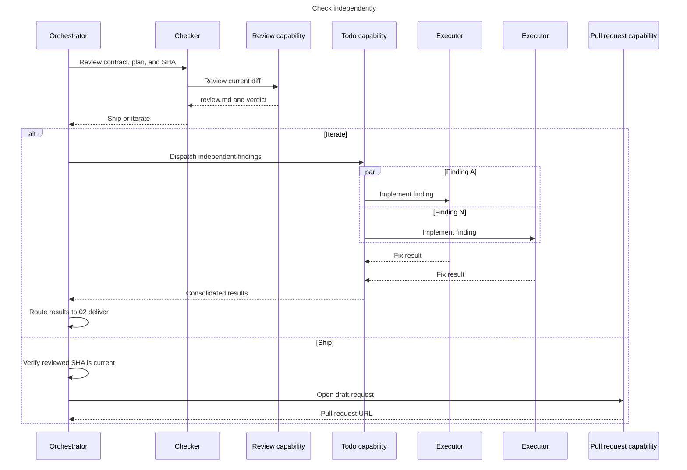

# 03 - Check

Review the candidate in a fresh context and route the verdict.

- The checker is fresh and read-only.
- Any blocking review finding returns `iterate`.
- Dispatch only independent findings through the todo capability, one executor per finding in parallel.
- Re-enter `02-deliver` to integrate, validate, commit, and run the final E2E gate.
- Only the orchestrator opens the pull request after verifying the reviewed SHA.
