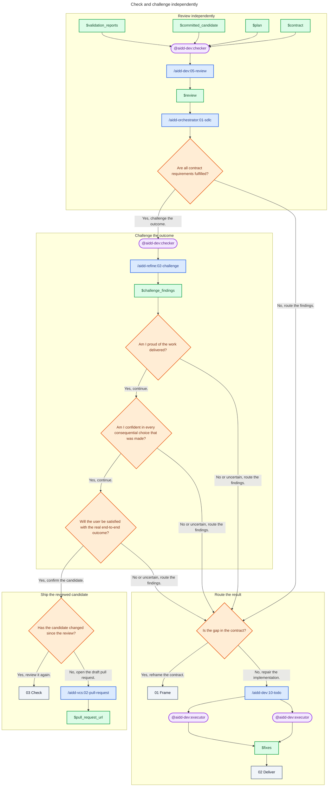

# 03 - Check

## Behavior

Use a fresh checker to review the candidate against the contract, plan, and validation evidence. After a green review, use another fresh checker to challenge the real outcome with the three confidence questions. Both checkers stay read-only.

Route need gaps to Frame. Dispatch independent implementation findings in parallel through Todo, one executor per finding. Keep dependent fixes together. Re-enter Deliver after every fix. If the candidate changed since the review, review it again. Otherwise open the draft pull request.

