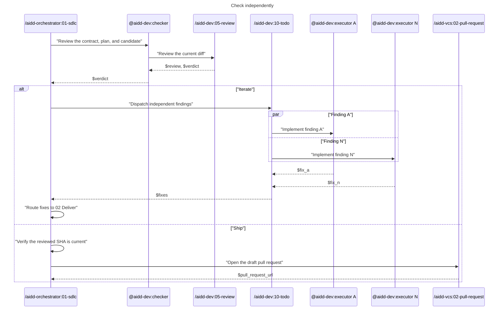

# 03 - Check

Review the candidate in a fresh context and route the verdict.

- `@aidd-dev:checker` is fresh and read-only.
- Any blocking review finding returns `iterate`.
- Dispatch only independent findings through `/aidd-dev:10-todo`, one `@aidd-dev:executor` per finding in parallel.
- Re-enter `02-deliver` to integrate, validate, commit, and run the final E2E gate.
- Only `/aidd-orchestrator:01-sdlc` calls `/aidd-vcs:02-pull-request` after verifying the reviewed SHA.
