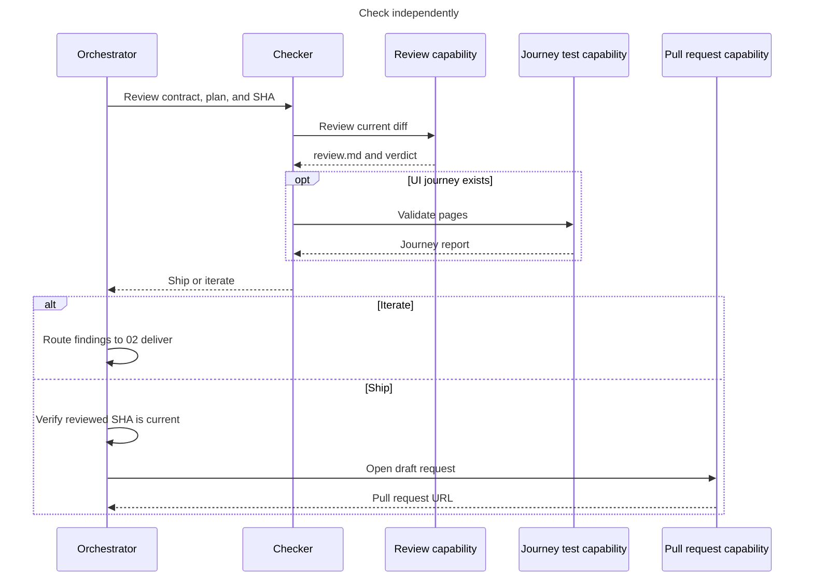

# 03 - Check

Review the candidate in a fresh context and route the verdict.

- The checker is fresh and read-only.
- Any blocking review finding or failed journey returns `iterate`.
- Only the orchestrator opens the pull request after verifying the reviewed SHA.
