# 03 - Check

Review the candidate, challenge the real outcome in a fresh context, and route the verdict.

```mermaid
---
title: Check and challenge independently
---
flowchart LR
  subgraph ReviewStage["Review independently"]
    direction TB
    Contract["$contract"]
    Plan["$plan"]
    CandidateSha["$candidate_sha"]
    ValidationReports["$validation_reports"]
    ReviewChecker(["@aidd-dev:checker"])
    Review["/aidd-dev:05-review"]
    ReviewArtifact["$review"]
    Sdlc["/aidd-orchestrator:01-sdlc"]
    ReviewVerdict{"Are all contract requirements fulfilled?"}
  end

  subgraph ChallengeStage["Challenge the outcome"]
    direction TB
    ConfidenceChecker(["@aidd-dev:checker"])
    Challenge["/aidd-refine:02-challenge"]
    ChallengeFindings["$challenge_findings"]
    Proud{"Am I proud of the work delivered?"}
    Confident{"Am I confident in every consequential choice that was made?"}
    Satisfied{"Will the user be satisfied with the real end-to-end outcome?"}
  end

  subgraph RouteStage["Route the result"]
    direction TB
    ContractGap{"Is the gap in the contract?"}
    Frame["01 Frame"]
    Todo["/aidd-dev:10-todo"]
    ExecutorFirst(["@aidd-dev:executor"])
    ExecutorLast(["@aidd-dev:executor"])
    Fixes["$fixes"]
    Deliver["02 Deliver"]
  end

  subgraph ShipStage["Ship the reviewed candidate"]
    direction TB
    CurrentSha{"Is the reviewed SHA still current?"}
    Check["03 Check"]
    PullRequest["/aidd-vcs:02-pull-request"]
    PullRequestUrl["$pull_request_url"]
  end

  Contract --> ReviewChecker
  Plan --> ReviewChecker
  CandidateSha --> ReviewChecker
  ValidationReports --> ReviewChecker
  ReviewChecker --> Review
  Review --> ReviewArtifact
  ReviewArtifact --> Sdlc
  Sdlc --> ReviewVerdict
  ReviewVerdict -- "No, route the findings." --> ContractGap
  ReviewVerdict -- "Yes, challenge the outcome." --> ConfidenceChecker
  ConfidenceChecker --> Challenge
  Challenge --> ChallengeFindings
  ChallengeFindings --> Proud
  Proud -- "Yes, continue." --> Confident
  Confident -- "Yes, continue." --> Satisfied
  Proud -- "No or uncertain, route the findings." --> ContractGap
  Confident -- "No or uncertain, route the findings." --> ContractGap
  Satisfied -- "No or uncertain, route the findings." --> ContractGap
  ContractGap -- "Yes, reframe the contract." --> Frame
  ContractGap -- "No, repair the implementation." --> Todo
  Todo --> ExecutorFirst
  Todo --> ExecutorLast
  ExecutorFirst --> Fixes
  ExecutorLast --> Fixes
  Fixes --> Deliver
  Satisfied -- "Yes, verify the reviewed SHA." --> CurrentSha
  CurrentSha -- "No, check the current candidate again." --> Check
  CurrentSha -- "Yes, open the draft pull request." --> PullRequest
  PullRequest --> PullRequestUrl

  classDef skill fill:#DBEAFE,stroke:#2563EB,color:#1E3A8A,stroke-width:2px
  classDef agent fill:#F3E8FF,stroke:#9333EA,color:#581C87,stroke-width:2px
  classDef artifact fill:#DCFCE7,stroke:#16A34A,color:#14532D,stroke-width:2px
  classDef decision fill:#FFEDD5,stroke:#EA580C,color:#7C2D12,stroke-width:2px
  classDef zone fill:#F1F5F9,stroke:#64748B,color:#0F172A,stroke-width:2px

  class Review,Sdlc,Challenge,Todo,PullRequest skill
  class ReviewChecker,ConfidenceChecker,ExecutorFirst,ExecutorLast agent
  class Contract,Plan,CandidateSha,ValidationReports,ReviewArtifact,ChallengeFindings,Fixes,PullRequestUrl artifact
  class ReviewVerdict,Proud,Confident,Satisfied,ContractGap,CurrentSha decision
  class Frame,Deliver,Check zone
```

- Give the review checker `$contract`, `$plan`, `$candidate_sha`, and every applicable validation report.
- The review checker and confidence checker are fresh and read-only; neither participated in implementation.
- Any blocking review finding returns `iterate`.
- After a green review, the confidence checker runs `/aidd-refine:02-challenge` against all evidence and answers the three questions independently.
- Every answer requires evidence. `No` or `Uncertain` returns `$challenge_findings`; need gaps go to `01-frame`, other gaps go through Todo to `02-deliver`.
- Dispatch only independent findings through `/aidd-dev:10-todo`, one `@aidd-dev:executor` per finding in parallel.
- Re-enter `02-deliver` to integrate, validate, commit, and run the final E2E gate.
- Only `/aidd-orchestrator:01-sdlc` calls `/aidd-vcs:02-pull-request` after verifying the reviewed SHA.
