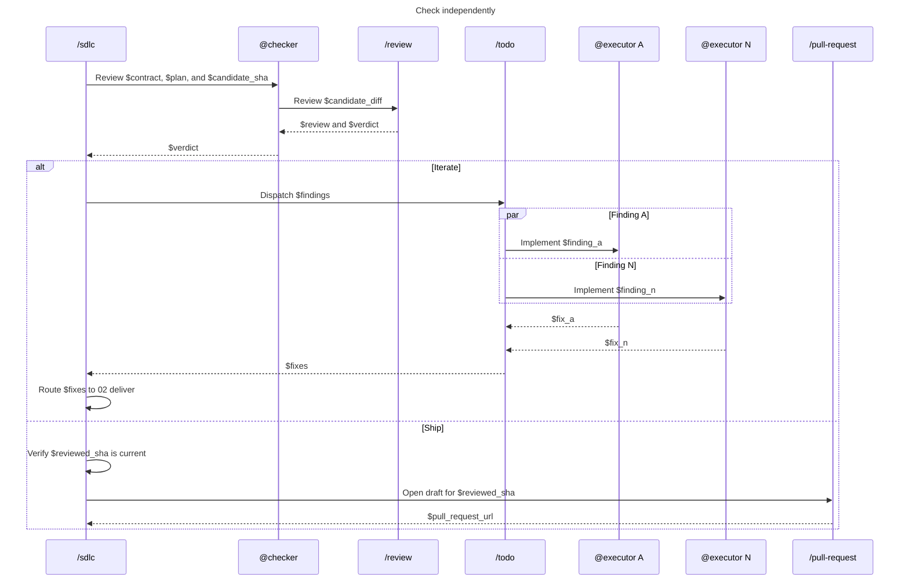

# 03 - Check

Review the candidate in a fresh context and route the verdict.

- `@checker` is fresh and read-only.
- Any blocking review finding returns `iterate`.
- Dispatch only independent findings through `/todo`, one `@executor` per finding in parallel.
- Re-enter `02-deliver` to integrate, validate, commit, and run the final E2E gate.
- Only `/sdlc` calls `/pull-request` after verifying the reviewed SHA.
