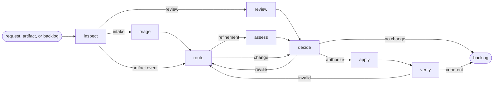

# Backlog

## Actions

Run the flow above. Read only the next action file.

| Action  | Does                                        |
| ------- | ------------------------------------------- |
| inspect | resolve the scope, event, and graph health  |
| triage  | classify intake and detect existing work    |
| review  | find actionable backlog health improvements |
| route   | delegate proposed artifact changes          |
| assess  | challenge refinement from three viewpoints  |
| decide  | reconcile proposals and confirm authority   |
| apply   | delegate authorized writes                  |
| verify  | prove the resulting graph is coherent       |

## Transversal rules

- Keep product, lifecycle, and backlog decisions with the user.
- Delegate artifact work to its owning capability; never copy its rules.
- Spawn only the three leaf reviewers defined by `05-assess`.
- Store each relation once, in its owning artifact.
- Run the backlog checker before and after authorized changes.
- Ask natural questions; never expose internal routes, checks, or unchanged state.
- Change only authorized artifacts and fields.
