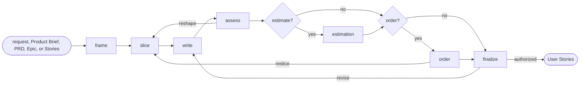

# User Stories

## Actions

Run the flow above. Read only the next action file.

| Action     | Does                                      |
| ---------- | ----------------------------------------- |
| frame      | resolve the source and Story scope        |
| slice      | find vertical deliverable slices          |
| write      | write Stories and acceptance              |
| assess     | determine readiness and blockers          |
| estimation | estimate only when applicable             |
| order      | order only when useful                    |
| finalize   | approve, persist, and link Stories        |

## Transversal rules

- Keep product and backlog decisions with the user.
- Separate evidence, decisions, and assumptions.
- Draft only after actor, need, and outcome are explicit in the source or confirmed.
- Ask natural questions; never expose actions, checks, routes, skipped work, or unchanged state.
- Preserve source links and existing edits.
- Treat a parent as a relation, never a Story write target.
- Require explicit approval or caller-provided bounded authority before any write or related-item change.
- For Markdown, run [the backlog checker](../../hooks/check-backlog.js) before writing and after; stop on existing findings, then correct this skill's findings.
