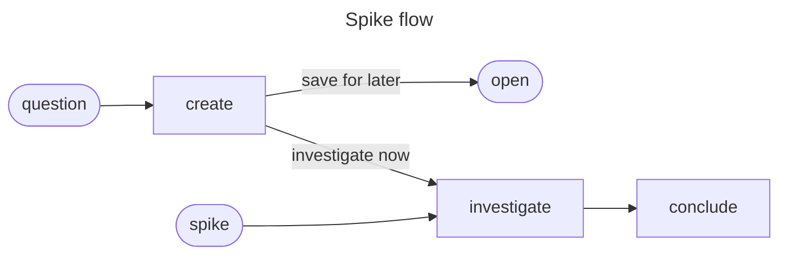

# Spike

## Actions

Run the flow above. Read only the next action's file before running it.

| Action      | Does                                  |
| ----------- | ------------------------------------- |
| create      | qualify and persist                    |
| investigate | collect evidence                       |
| conclude    | write outcome and sync parents         |

## Transversal rules

- Require approval before spike creation or parent changes.
- Follow approved route and bounds; ask when either is absent.
- Preserve edits, evidence, and links.
- Touch only the spike and approved related artifacts.
