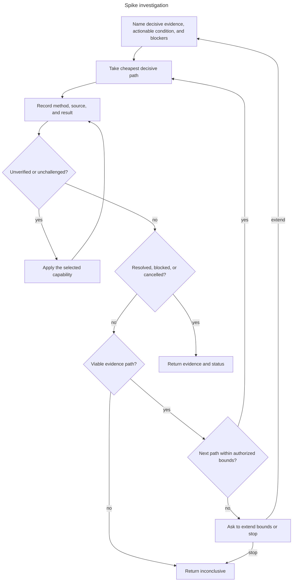

# Investigation

Bound research by decisive evidence, not elapsed time.

- Change the hypothesis, input, or method before retrying.
- Ask whether to extend or stop before changing status when a viable path exceeds bounds.
