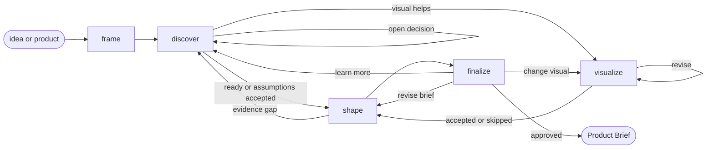

# Product Brief

## Actions

Run the flow above. Read only the next action's file before running it.

| Action    | Does                                 |
| --------- | ------------------------------------ |
| frame     | establish scope and evidence path    |
| discover  | research, question, and challenge    |
| visualize | clarify with an optional product view |
| shape     | compose one Product Brief            |
| finalize  | refine, approve, and persist          |

## Transversal rules

- Separate evidence, decisions, and assumptions.
- Keep product decisions with the user.
- Keep actions and technique names out of user-facing text.
