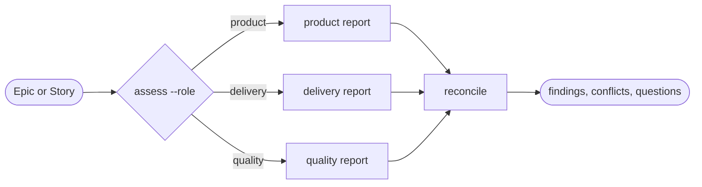

# Three Amigos

## Actions

Run one route per invocation. Read only that action file.

| Action    | Does                                             |
| --------- | ------------------------------------------------ |
| assess    | apply one requested lens to an Epic or Story     |
| reconcile | reconcile three independent, caller-supplied reports |

## Transversal rules

- Never spawn, delegate, persist, or mutate.
- Treat roles as analytical lenses, not human authorities.
- Ground every finding and question in cited evidence; never invent a decision.
- Return proposals only. The caller must hold explicit user authority before applying any change.
