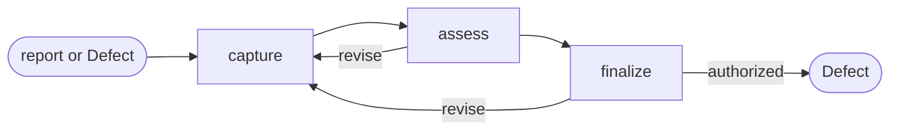

# Defect

## Actions

Run the flow above. Read only the next action file.

| Action   | Does                                      |
| -------- | ----------------------------------------- |
| capture  | frame one observed product mismatch       |
| assess   | establish evidence, impact, and readiness |
| finalize | persist or transition the Defect           |

## Transversal rules

- Keep product, priority, and lifecycle decisions with the user.
- Separate observation, evidence, and inference.
- Record the defect; never diagnose or implement its fix.
- Preserve source evidence and existing edits.
- Require explicit approval or caller-provided bounded authority before any write or related-item change.
- For Markdown, run [the backlog checker](../../hooks/check-backlog.js) before writing and after; stop on existing findings, then correct this skill's findings.
