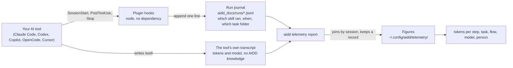
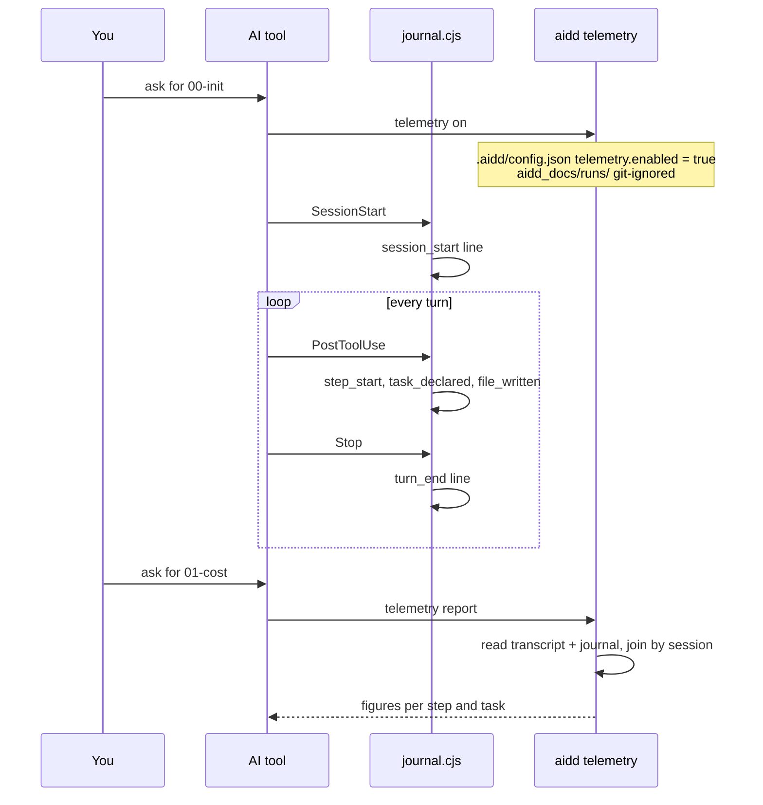

← [aidd-framework](../../README.md)

# aidd-telemetry

Know what a piece of work cost: which skill, which step and which task spent the tokens.

> Status: beta. Proven end to end on Claude Code; the other four tools are covered to the
> extent their own files allow, see [Coverage](#coverage). Off the curated install path
> until it has run on other people's machines.

## What it does

Your provider can tell you a developer burned four million tokens on Tuesday. This plugin
tells you that `aidd-dev:02-implement` spent 78,188 of them, on task `2026_09_01_the-upward-link`,
inside one orchestrated flow. It attributes consumption to the framework's own units of work.

```text
period    2026-08-21 to 2026-08-21

  sessions                  1
  requests                  3
  tokens                    116,678    80% cache
  cost                      amount unknown

  by step    of tokens
    aidd-ui:01-hello           67%   78,188 tokens    stated by the tool
    aidd-ui:01-hello           33%   38,490 tokens    from a journal interval
```

Three things it never does: it never sends anything anywhere, it never stores a prompt, a
diff or a line of code, and it never records until you turn it on.

## How it works

Two sources exist already. The plugin adds the one thing that joins them.



- **The hooks journal.** While measurement is on, every session appends one line per
  observation to `aidd_docs/runs/<run_id>__<vendor_id>.jsonl`, git-ignored, never rewritten.
  No token, no cost, no model lands there.
- **Your tool writes its own transcript**, in its own place and format. It holds the tokens
  and knows nothing about skills.
- **`aidd telemetry report` joins the two.** It reads the transcript, normalises it into one
  shape whatever tool produced it, matches each record against the journal and keeps the
  result under `~/.config/aidd/telemetry/`. The join cannot happen live: when a hook fires,
  the tokens for that turn are not written yet.

Recording is the one act that depends on nothing: the hooks run under plain `node`, so a
session is measured whether or not `aidd` is installed. Allowing and answering go through
the CLI, so the figure is computed once, in one place, whatever asked for it.

## Getting started

```sh
npm install -g @ai-driven-dev/cli
aidd plugin install aidd-telemetry
```

Then talk to your AI tool. Each skill reaches the CLI and stops with the reason if `aidd`
does not answer, rather than reporting an empty figure.

| Ask your tool for | It runs | You get |
| --- | --- | --- |
| `00-init` | `aidd telemetry on`, then `check` | measurement allowed for this project, and proof the switch took |
| `01-cost` | `aidd telemetry report` | what a period or one task consumed, by step, model, task, flow, tool or person |
| `02-check` | `aidd telemetry check` | whether the chain is actually recording, and what to fix if not |

Your tool's own plugin mechanism installs the plugin just as well. The CLI stays required
for one reason: nothing recorded can be read without it.



## What a figure tells you about itself

Every attributed figure says how it was attributed, because the two ways are not the same
claim.

| Reads | Means |
| --- | --- |
| stated by the tool | the tool named the running skill itself, on the line with the counters: exact |
| from a journal interval | derived from the interval between two boundaries the journal recorded: an inference |
| unattributed | neither source could say. It never means "no step ran" |

An absent figure is named, never shown as a zero. A tool that cannot be read, one that
carries no amount, one that measured nothing and one whose reader failed are four
different answers. No tool read locally writes a figure in currency: reports give tokens,
and turning tokens into money is a separate service's job.

## Coverage

| Tool | Tokens | Step | Task |
| --- | --- | --- | --- |
| **Claude Code** | ✅ proven on live sessions | ✅ stated by the tool, and by interval | ✅ |
| **Codex** | ✅ on captured rollouts | ✅ by interval | ✅ |
| **OpenCode** | ✅ | ✅ through its own plugin API | ✅ |
| **Copilot** | ⚠️ session total only, no per-request figure (one cumulative total at shutdown) | ✅ by interval ([#663](https://github.com/ai-driven-dev/framework/issues/663)) | ✅ |
| **Cursor** | ❌ no token count in any file it writes | ✅ | ✅ |

<details>
<summary>Measured limits, per tool</summary>

- **Codex needs one interactive approval.** Its hook trust is per entry and a headless run
  never sees the prompt, so a Codex session journals nothing until someone approves once,
  in an interactive session.
- **OpenCode never announces a session, so the plugin opens it.** Measured on one live
  `opencode 1.14.20` run (2026-08-31, `--print-logs`): `session.created` is published on
  the bus but never reaches the hook, while `session.idle` reaches every session. The first
  call a session produces therefore opens it, under the directory that call was going to
  use. What is lost: on a server serving several directories, a session it never announced
  is journalled under the plugin's own init-time directory. Details in
  `scripts/__tests__/fixtures/README.md`, "OpenCode's plugin events".
- **A task is declared from a tool call's own arguments, on every host.** A `Read`, a `Bash`
  command line or an object keyed `path` naming a file under a task folder is enough; the
  journal reads that text rather than asking the host to cooperate. OpenCode joined on
  2026-08-31 once a completed tool part's arguments were measured to reach its `event`
  hook. One real capture per host is kept in `scripts/__tests__/fixtures/README.md`.
- **These are raw counters, not your tool's usage screen.** A vendor's page weights a
  cached token by what it charges for it; these figures are the counts the tool wrote down.
  The two disagree on cache lines by construction, and neither is wrong.
- **A period means when the work ran**, not when it was billed.
- **A sweep reaches a session only where the journal was installed.** Work done before you
  turned measurement on is not there, and nothing reconstructs it.

</details>

## Privacy

- **Nothing leaves the machine.** Every code path that once could, the export writer, its
  endpoint, the server it talked to, is deleted. Everything measured is read back from
  where it was written. On a machine that ran an older version's `aidd telemetry endpoint`,
  `aidd telemetry check` and `aidd telemetry off` both detect the settings file it left
  and name what to remove by hand.
- **No prompt, no code, no diff.** The stored shape is an allowlist, field by field, in
  [the record contract](../../aidd_docs/product/metrics-contract.md).
- **The switch is a file you commit or do not**, per project (`.aidd/config.json`). Once
  committed on, it applies to everyone who clones. Refuse it for yourself alone with
  `AIDD_TELEMETRY=0`, which overrides the file unconditionally.
- **`off` keeps what you measured.** It stops the recording, not the record.
  **`aidd telemetry forget` removes it**: this project's journal, this machine's stored
  records (every project ever measured on this machine) and this machine's identity file.
  It shows what would go before anything happens and removes nothing without `--yes`.
- **Your identity is yours to attach.** `aidd telemetry identity` opts a person in or out
  of naming themselves on their own records; nothing about a colleague's identity arrives on
  its own.

## Where things live

| What | Where | Why there |
| --- | --- | --- |
| The switch | `.aidd/config.json` in the project | a property of the repository, shared by committing it |
| The journal | `aidd_docs/runs/` in the project, git-ignored | every line names a repository-relative path or a task folder |
| The figures | `~/.config/aidd/telemetry/` (`%APPDATA%\aidd\telemetry\` on Windows), or `AIDD_TELEMETRY_DIR` | a session's consumption belongs to the person who ran it |
| The identity | the OS profile, on every platform | it never follows a shared directory |

**Share `AIDD_TELEMETRY_DIR`, never `AIDD_USER_CONFIG_DIR`.** Point the first at a directory
a team shares and every figure follows it. The second relocates a machine's whole AIDD
configuration, `auth.json` and its GitHub token included, and two people pointing at one
directory would overwrite each other's token file. A setup made before this split still
works through `AIDD_USER_CONFIG_DIR`, and should be changed.

On a shared sink, a colleague's records stay `unresolved` in your report until you run
`aidd telemetry identity link` on their identifier yourself. Linking declares "this
identifier is me", and the CLI cannot check that claim against anything the colleague wrote.

## The backlog link

A task folder can say which backlog item it delivers. `aidd-pm:04-spec` and
`aidd-dev:01-plan` write `backlog-link.json` beside `spec.md` and `plan.md` when the request
they build from names one. No file is the normal state, never an error.

```json
{
  "backlog": "owner/repo#123",
  "written_at": "2026-08-21T09:00:00Z",
  "written_by": "aidd-pm:04-spec"
}
```

`backlog` names the item wherever it lives, a forge reference or a project-relative
Markdown path, one field for both per
[`persistence.md`](../aidd-pm/skills/10-task/references/persistence.md). `written_at` and
`written_by` are provenance, not status. It is a plain file: edit `backlog` and the next
report reads it as it stands. Nothing here re-derives or overwrites a declaration that
exists. It carries no steps, no file list, no branch and no status: the journal, git and
the artefacts' own frontmatter already own those.

## Where things are written down

- [`aidd_docs/runs/README.md`](../../aidd_docs/runs/README.md): what the journal records,
  and what it deliberately does not.
- [`cost-report-contract.md`](../../aidd_docs/product/cost-report-contract.md): the object
  `report --json` prints, for a skill or a program to consume.
- [`metrics-contract.md`](../../aidd_docs/product/metrics-contract.md): one stored line,
  for a service that prices them.
