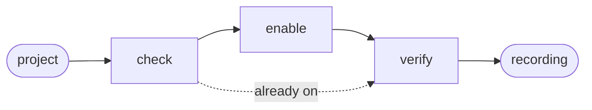
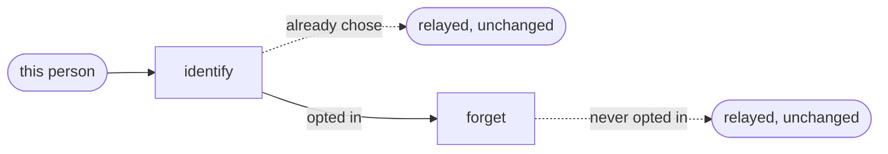

# Init

A second, independent choice belongs to the person rather than the project: whether their
own records carry an identifier at all.

## Actions

Run the flow above. Read only the next action file.

| Action   | Does                                                    |
| -------- | -------------------------------------------------------- |
| check    | confirm the CLI and read the current switch                |
| enable   | ask, then turn measurement on                              |
| verify   | prove a session is actually being recorded                 |
| identify | ask this person, then attach their own identifier, and offer to link another identifier as the same one |
| forget   | withdraw it, without touching what is already stored       |

## Transversal rules

- Measuring someone's project is theirs to allow. Ask before turning it on, always.
- Naming a person is theirs alone to allow, separately from the project switch above — never assumed from the project being measured, never asked on someone else's behalf.
- Run only `aidd telemetry on`, `aidd telemetry off`, and `aidd telemetry identity`'s own verbs. Never a script, and never a command belonging to another skill.
- `aidd telemetry identity` never reads `.aidd/config.json` or `AIDD_USER_CONFIG_DIR` — both are settings a repository or a CI job can set, and this choice is not theirs to make. It reads and writes only this machine's own user profile.
- The `aidd` command cannot be found: say so and change nothing.
