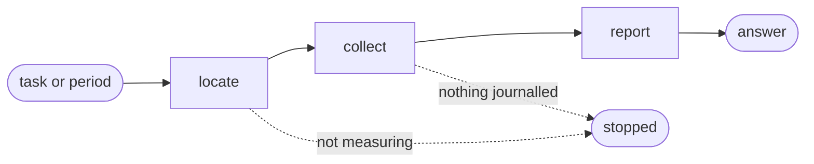

# Cost

## Actions

Run the flow above. Read only the next action file.

| Action  | Does                                              |
| ------- | -------------------------------------------------- |
| locate  | find the script and check the switch               |
| collect | read what each tool's own files hold               |
| report  | choose the axis the question needs, then answer with the artefact it deserves |

## The question, not the flag

Someone asking what last month cost does not know which axis answers them. Read the
question, offer these axes in its own language, and derive the flags - never hand back a
menu and ask them to pick.

| The question sounds like | Axis | Artefact |
| --- | --- | --- |
| what did this cost, what do we owe | total | one total, in a line |
| what changed, which day spiked | day | a series, one row per day |
| where did it go, which step, model, tool or project took it | step, model, tool or project | a breakdown table |
| for a report, to paste, to send, to keep | any of the above | the same artefact, written to a file |
| per person, who spent, which teammate | none - unanswerable | said plainly, with what would fix it |

**Per person cannot be answered today.** Nothing records an identity anywhere in what this
plugin measures. It becomes answerable only once measurement records an identity at all and
resolves one identity across tools and machines - name that missing path rather than
approximating a person from a project, a tool or a machine, none of which is one.

## Transversal rules

- Run only `scripts/telemetry-report.cjs`, beside this skill. Never a script belonging to another skill, and never the `aidd` command.
- Report what the script printed. Recomputing a figure a second way is how two figures start disagreeing.
- An absent number is not a zero. Say the figure is unknown and give what is known instead.
- Turning measurement on belongs elsewhere. Stop and say so rather than doing it here.
- The script cannot be found or fails: say so and show no figure.
