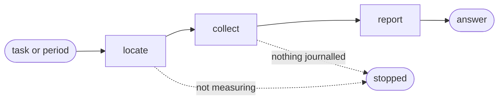

# Cost

## Actions

Run the flow above. Read only the next action file.

| Action  | Does                                    |
| ------- | --------------------------------------- |
| locate  | find the script and check the switch    |
| collect | read what each tool's own files hold    |
| report  | ask for the figures and answer from them |

## Transversal rules

- Run only `scripts/telemetry-report.js`, beside this skill. Never a script belonging to another skill, and never the `aidd` command.
- Report what the script printed. Recomputing a figure a second way is how two figures start disagreeing.
- An absent number is not a zero. Say the figure is unknown and give what is known instead.
- Turning measurement on belongs elsewhere. Stop and say so rather than doing it here.
- The script cannot be found or fails: say so and show no figure.
