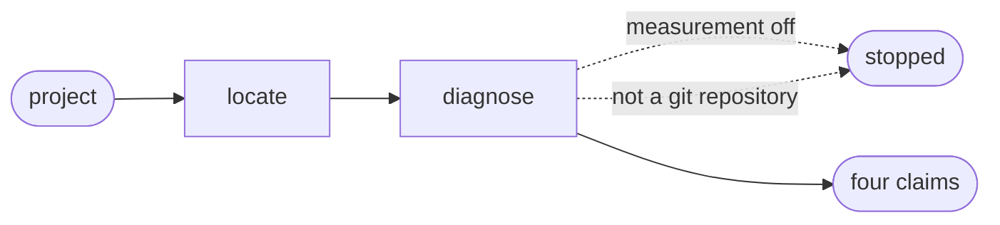

# Check

## Actions

Run the flow above. Read only the next action file.

| Action   | Does                                       |
| -------- | ------------------------------------------- |
| locate   | confirm the CLI                              |
| diagnose | run it, and present every line it printed    |

## Transversal rules

- Checking that a hook fired is not the same as checking that a file exists. A run file with only `session_start` is not evidence of anything closed.
- Run only `aidd telemetry check`. Never a script, and never a command belonging to another skill.
- Present every printed line. A line this skill leaves out is a claim the user cannot check.
- `ok`, `FAIL` and `--` are three different answers. `--` means there was nothing to evaluate, not that the chain is healthy.
- The `aidd` command cannot be found: say so and check nothing.
