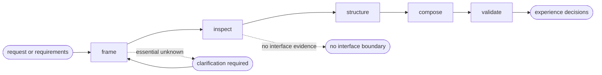

# UI Design

## Actions

Read only the next action file required by the flow above.

| Action    | Does                              |
| --------- | --------------------------------- |
| frame     | isolate the interface intent      |
| inspect   | map the existing interface system |
| structure | define the experience structure   |
| compose   | decide the interface direction    |
| validate  | verify the experience decisions   |

## Transversal rules

- Trace every meaningful decision to a requirement, task, constraint, or confirmed convention.
- Never modify application source or project memory.
- Identify a potential stable convention separately from a feature decision.
