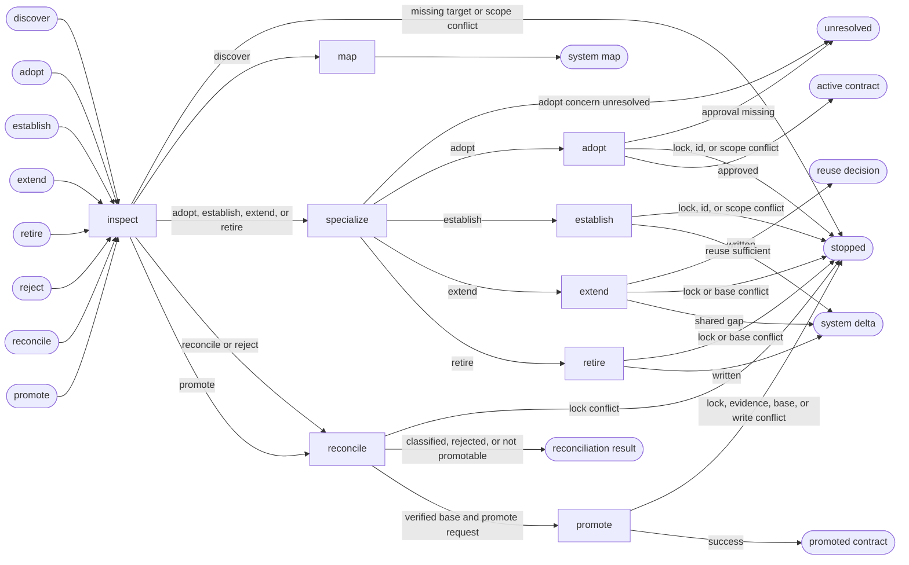

# UI System

## Actions

Read only the next action file required by the flow above.

| Action | Does |
| --- | --- |
| inspect | resolve system scope and evidence |
| map | report the current interface system |
| specialize | obtain applicable specialist decisions |
| adopt | record an implemented system |
| establish | authorize a minimum viable system |
| extend | authorize the smallest shared change |
| retire | authorize removal of an active system |
| reconcile | classify contract and implementation drift |
| promote | merge a verified delta into the contract |

## Transversal rules

- Own versioned shared UI system contracts and their change deltas.
- Never modify application source or project memory.
