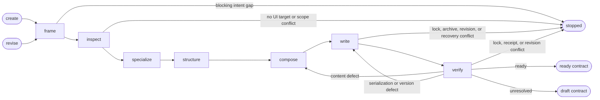

# UI Design

## Actions

Read only the next action file required by the flow above.

| Action | Does |
| --- | --- |
| frame | isolate the feature intent |
| inspect | resolve existing UI authority |
| specialize | obtain applicable specialist decisions |
| structure | define feature structure and states |
| compose | decide the feature experience |
| write | record the versioned UI contract |
| verify | prove contract readiness |

## Transversal rules

- Own feature-local experience decisions.
- Reference shared system decisions by exact revision.
- In revise mode, preserve information architecture and task flow unless the source explicitly authorizes changing them.
- Preserve factual or legal meaning unless the source explicitly authorizes changing it.
- Never modify application source, UI system contracts, or project memory.
