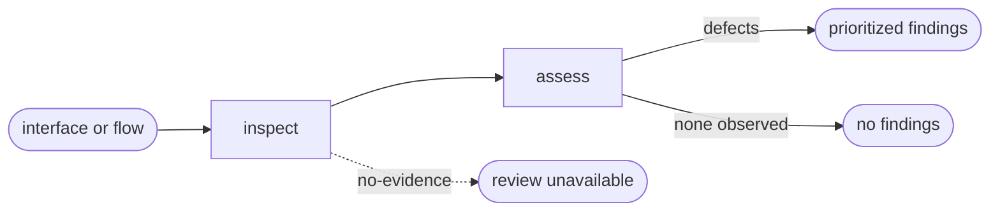

# UI Review

## Actions

Read only the next action file required by the flow above.

| Action  | Does                              |
| ------- | --------------------------------- |
| inspect | collect observable UI evidence    |
| assess  | prioritize experience consequences |

## Transversal rules

- Review experience correctness, not general implementation quality.
- Never modify application source or project memory.
- State which review dimensions were covered and which lacked evidence.
