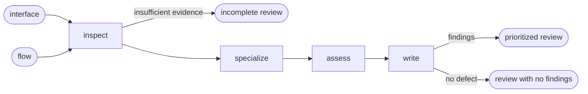

# UI Review

## Actions

Read only the next action file required by the flow above.

| Action | Does |
| --- | --- |
| inspect | pin review targets and evidence |
| specialize | obtain applicable specialist verdicts |
| assess | diagnose feature experience defects |
| write | record the nonnormative review |

## Transversal rules

- Own cross-concern task diagnosis and priority.
- Specialists own accessibility and adaptation verdicts.
- Treat findings as nonnormative.
- State assessed and unassessed coverage explicitly.
