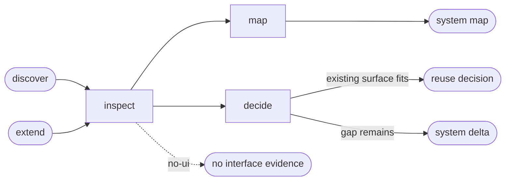

# Interface System

## Actions

Read only the next action file required by the flow above.

| Action  | Does                                  |
| ------- | ------------------------------------- |
| inspect | locate the current interface system   |
| map     | summarize stable system conventions   |
| decide  | choose reuse or the smallest extension |

## Transversal rules

- Current repository evidence is authoritative when project memory drifts.
- Never modify application source or project memory.
- Keep separate frontend workspaces separate when their systems differ.
