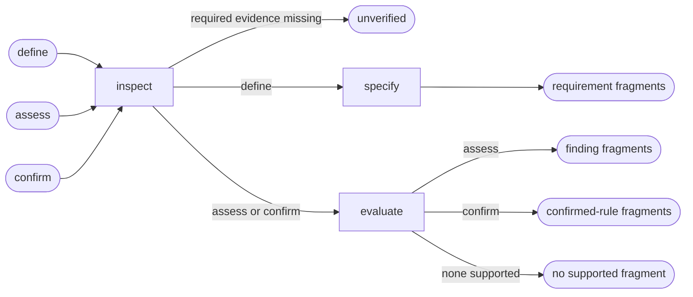

# Accessibility

## Actions

Read only the next action file required by the flow above.

| Action | Does |
| --- | --- |
| inspect | collect applicable accessibility evidence |
| specify | return requirement fragments |
| evaluate | return findings or confirmed rules |

## Transversal rules

- Own accessibility requirements and verdicts.
- Do not own overall review priority or artifact composition.
- Never modify application source, UI artifacts, or project memory.
