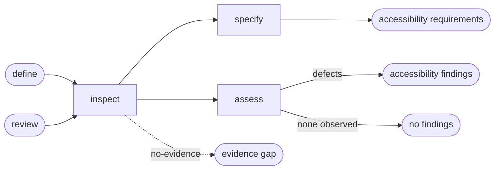

# Accessibility

## Actions

Read only the next action file required by the flow above.

| Action  | Does                                      |
| ------- | ----------------------------------------- |
| inspect | collect interface accessibility evidence |
| specify | define applicable accessibility behavior |
| assess  | report evidenced accessibility defects   |

## Transversal rules

- Enforce the project's confirmed accessibility bar before adding a new one.
- Evaluate only concerns that apply to the interface and available evidence.
- Never modify application source or project memory.
