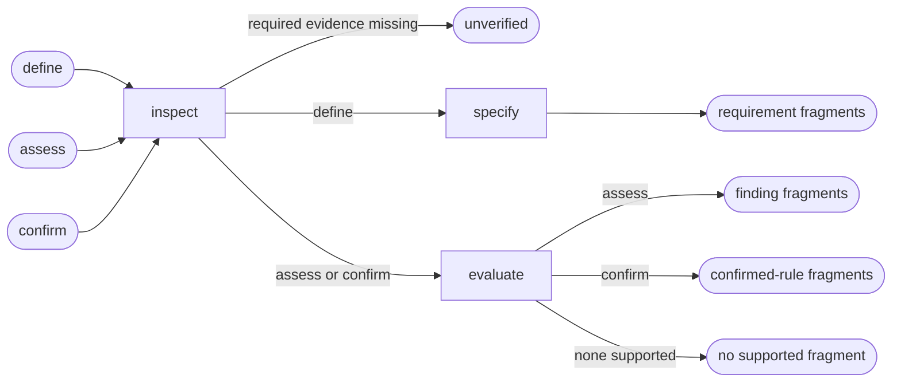

# UI Adaptation

## Actions

Read only the next action file required by the flow above.

| Action | Does |
| --- | --- |
| inspect | collect adaptation evidence |
| specify | return requirement fragments |
| evaluate | return findings or confirmed rules |

## Transversal rules

- Own transformations across context.
- Feature design owns invariant task hierarchy.
- Exclude keyboard operability, focus, minimum target size, and accessibility zoom.
- Accessibility owns excluded concerns.
- Never modify application source, UI artifacts, or project memory.
