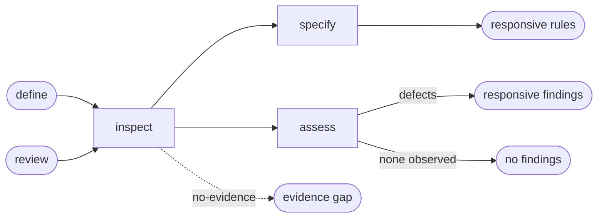

# Responsive Behavior

## Actions

Read only the next action file required by the flow above.

| Action  | Does                                 |
| ------- | ------------------------------------ |
| inspect | map existing responsive conventions |
| specify | define constrained-space behavior   |
| assess  | report responsive behavior defects  |

## Transversal rules

- Preserve task priority and information hierarchy across space and input changes.
- Reuse confirmed breakpoints and layout primitives before extending them.
- Never modify application source or project memory.
