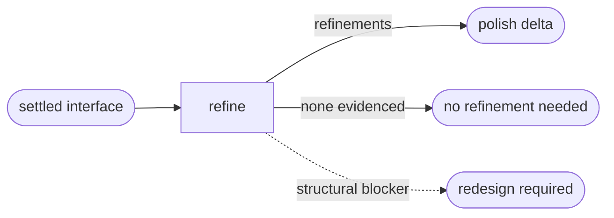

# UI Polish

## Actions

Read only the next action file required by the flow above.

| Action | Does                                  |
| ------ | ------------------------------------- |
| refine | define bounded interface refinements |

## Transversal rules

- Polish follows settled intent, structure, behavior, accessibility, and responsive decisions.
- Never silently change information architecture or task flow.
- Never modify application source or project memory.
