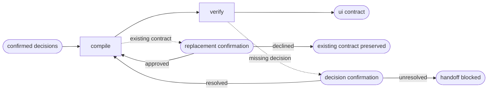

# UI Handoff

## Actions

Read only the next action file required by the flow above.

| Action  | Does                            |
| ------- | ------------------------------- |
| compile | write the experience contract   |
| verify  | remove implementation ambiguity |

## Transversal rules

- Compile confirmed decisions; never invent missing product or experience choices.
- Preserve engineering freedom beyond observable experience constraints.
- Never modify application source or project memory.
