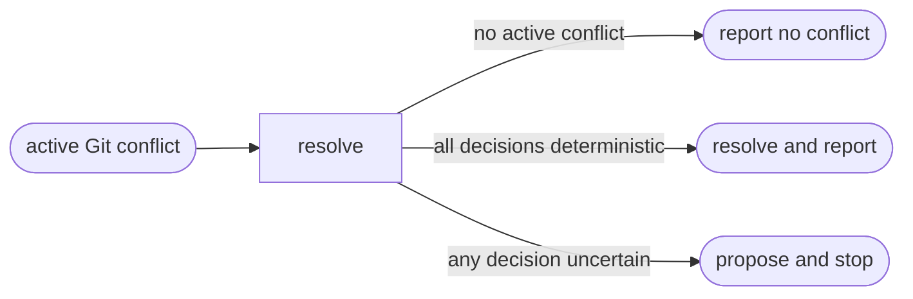

# Resolve Conflict

## Actions

Read only the next action file.

| Action | Does |
| ------ | ---- |
| resolve | resolve safe conflicts or propose a choice |

## Transversal rules

- Never commit, discard, reset, or check out changes.
- Stage only files resolved by this skill, never unrelated files.
