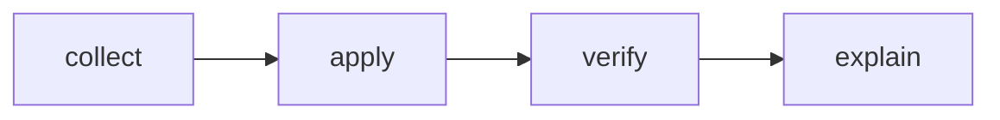

# Review Apply

## Actions

Read only the next action's file before running it.

| #   | Action    | Does                                                                |
| --- | --------- | -------------------------------------------------------------------- |
| 01  | `collect` | Confirm the branch matches the PR and fetch the open review comments |
| 02  | `apply`   | Read the context per comment and apply one scoped fix each           |
| 03  | `verify`  | Typecheck the touched files and review the diff                      |
| 04  | `explain` | Summarize what each comment asked, the fix, and the verification     |

## Transversal rules

- Copilot and any user whose `type` is `Bot` are always excluded.
- Never commit or push here — that is a separate, explicit step.
- Never reply to the GitHub comments here — that is `aidd-vcs:05-review-reply`.
- A fix stays scoped to its comment: no reformatting or refactor beyond what was asked.